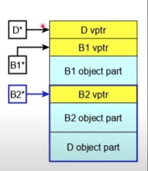
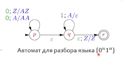
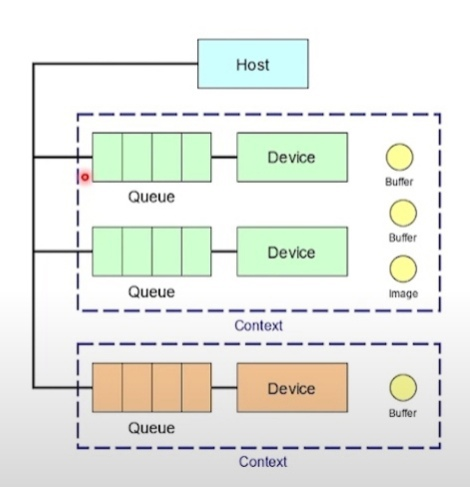
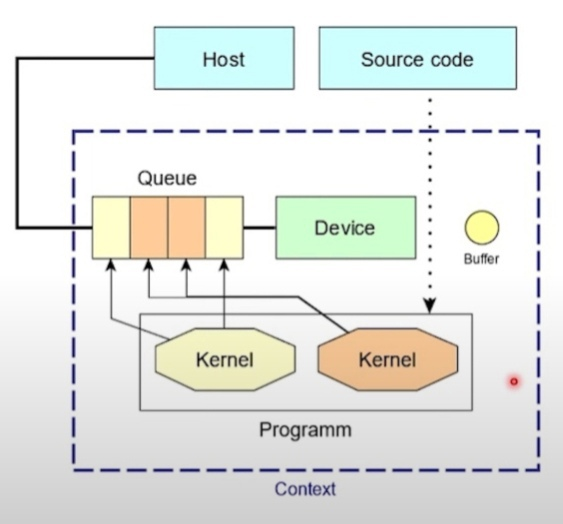
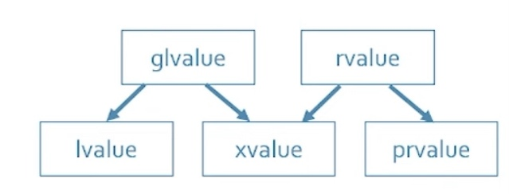
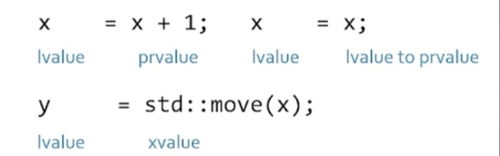
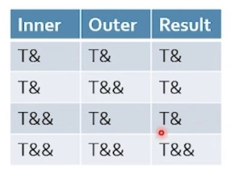
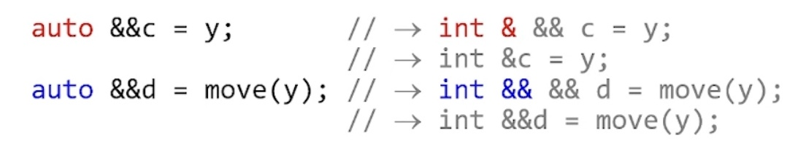
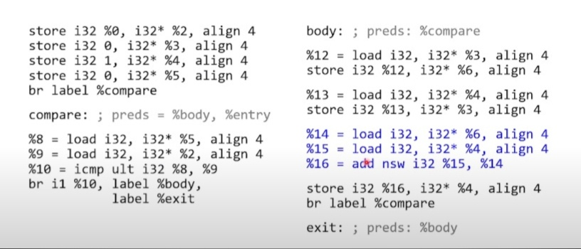
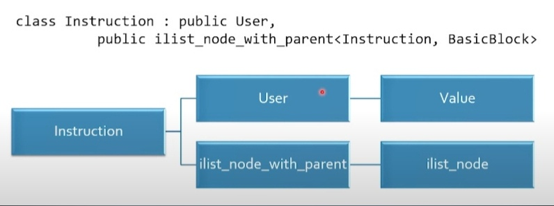

# Введение #
Этот документ представляет собой конспект лекций базового курса МФТИ по C++.
---
# Список тем курса #
- Лекция 3
    * Ссылки и указатели
    * lvalue и rvalue
    * using и cdecl
    * Манглирование 
    * Разрешение имен
    * Пространства имен
- Лекция 4
    * Инициалзация
    * Делегация конструкторов
    * RVO
    * Конструктор копирования
    * Квалификации 
    * Пользовательские преобразования
- Лекция 5
    * Владение ресурсами
    * RAI
    * Оператор *
    * Оператор ->
    * rvalue
    * std::move()
    * Аннотация методов
    * Возврат ссылок
    * Конструктор перемещения
    * Реализация std::swap()
    * Правило пяти 
    * Правило нуля
- Лекция 6
    * Статические функции
    * noexcept
    * Селекторы
    * Прокси
    * unique_ptr
    * Приведение типов
    * Strict aliasing violation
    * Арифметика
    * Унарный плюс
    * Операторы вне класса
- Лекция 7
    * Функторы
    * Pimpl
    * Проход по контейнеру
    * Переопределение бинарных операторов
    * Побитовый сдвиг
    * Тривалентное сравнение
- Лекция 8
    * ParaCL
    * Отличие =default и пустого деструктора
    * Наследование
    * Приведение типов
    * Circle and ellipse problem
    * Принцип подстановки Лисков
    * Проблема срезки(начальная версия)
    * Полиморфизм 
    * Виртуальные функции   
    * Чисто виртуальные методы
    * Виртуальный деструктор
    * Интерфейсные классы
    * Виртуальное копирование
    * Проблема срезки 
    * Правильный класс
    * EBCO
    * Pure virtual function call
    * Связывание 
    * NVI
    * Виды полиморфизма 
    * Приватное наследование
    * Protected наследование
    * Отличие struct от class
- Лекция 9
    * Ромбовидные схемы
    * Виртуальное наследование
    * Конструкторы
    * Преобразования 
    * RTTI
    * dynamic_cast
    * Регулярные выражения
    * Регулярные выражения в С++
    * Детерминированный конечный автомат
    * Недетерминированный конечный автомат
    * FLEX
    * Лемма о накачке
- Лекция 10
    * Грамматика
    * Автоматы с магазинной памятью 
    * Таксономия L\R
    * Рекурсивный спуск
    * LL(1) парсер
    * LR(k) парсер
- Лекция 11
    * Исключения 
    * throw 
    * std::exception
    * Нейтральная функция
    * Try-блоки уровня функций
    * Гарантии безопасности
    * Линия Калба
- Лекция 12
    * Условный noexcept
    * Оператор noexcept
    * std::uncaught_exceptions()
    * pop в vector<>
    * Оператор new 
    * Зазмещающий new
    * Проектирование с исключениями
    * static_assert 
- Лекция 15
    * Гетерогенные системы
    * OpenCL
    * Вычисления OpenCL
- Лекция 16 
    * OpenCL API
    * Специализация шаблонов
    * Type traits
    * Инстанцирование
    * Частная специализация
    * Разрешение имен
- Лекция 17 
    * Вывод типов
    * Вывод конструкторами
    * Хинты для вывода
    * Вывод без конструктора
    * auto и decltype
    * Категории выражений
    * decltype(expression)
    * Сигнатуры функций
    * for auto
    * Идиома AAA
    * Свертка ссылок
    * Неуниверсальные ссылки
    * for auto&&
    * Идиома AAARR
- Лекция 21
    * LLVM IR
    * SSA представление
    * Типы 
    * Числа Фибоначи
    * store & load
    * GEP
    * alloca
    * Архитектура LLVM
- Лекция LLVM IR
    * Заметки

## Лекция 3 ##

### Ссылки и указатели ###
Константные ссылки продлевают время жизни временного объекта. Время жизни таких объектов длится до конца полного выражения. Пример провисания ссылки в структуре:

```cpp
struct S {

    int x;
    const int& y;
};

S x{1, 2}; //ссылка не провисла, потому что был создан постоянный объект на стеке
S* ptr = new S{1, 2}; //ссылка провисла, так как был создан временный объект, и конец полного выражения наступил до присваивания   
```

Возвращение константных ссылок из функций может привести к провисанию. 

### lvalue и rvalue ###
В отличие от lvalue у rvalue нету постоянного места в памяти.

```cpp
int& foo();
foo() = x; //верное выражение, поскольку функция может возвращать ссылку на выделенную память
```

### using и cdecl ###
Чтение типов: идем вправо, затем влево и в конце выходим из скобок. Пример:

```cpp
int *x[20]; //массив указателей на int
int (*y)[20]; //указатель на массив int
int (&z)[20] = *y; //ссылка на массив
```

Для упрощения объявлений используется ключевое слово using:

```cpp
using ptr_to_func_ref = void (*) (int&) //вместо звездочки имя функции

template <typename T>
using ptr_to_func_ref = void (*) (T&); //набор указателей на функцию 
```

### Манглирование ###
Манглирование - процесс искажения имен при переводе языка в ассемблер. При отсутствии манглирования возможно создание API, с помощью которых возможно общение программ на разных языках. 

Из-за гарантии по именам в С невозможно:
1. перегружать функции
2. получать методы классов(структур)
3. получить шаблон 

Для получения стабильного имени в C++ используется:

```cpp
extern "C" double sqrt(double); //для этой функции невозможны перегрузки и namespace
```

### Разрешение имен ###
При разрешении имен выбираются кандидаты, подходящие по сигнатуре. После этого из них выбирается нужный по правилам:
1. Точное совпадение(int -> int; int -> const int&, ...)
2. Точное совпадение с шаблоном(int -> T)
3. Стандартное преобразование(int -> char, float -> unsigned short)
4. Пользовательские преобразования
5. Объекты с переменным числом аргументов
6. Неправильно связанные ссылки

### Пространства имен ###
Пространство имен добавляет манглрование к каждому объекту, входящему в него. Пространство имен можно переоткрывать для добавления туды сущностей:

```cpp
namespace X{
    int foo(); //добавление функции в пространство имен X
}   

using std::vector; //добавление сущности в текущее пространство имен
using namespace X; //добавление всех объектов из X 
```

Анонимные пространства имен

```cpp
namespace { //создался namespace с уникальным именем и сразу был вызван using

    int foo(){

        return 42;
    }
}

int bar() { return foo(); } //внутри текущего модуля можно вызывать foo
```

Правила работы с namespace:
* Не засорять глобальное пространство именем
* Не писать using namespace в заголовочных файлах
* Использовать анонимные пространства имен вместо статических функций(не для классов)
* не использовать анонимные пространства имен в заголовочных файлах

Функция main не манглируется. 

## Лекция 4 ##

### Инициалзация ###
В парсере С++ есть два важных правила:
* Все, что может быть засчитано за объявление функции, является объявлением функции.
* Все, что может считаться обращением к полю, считается обращением к полю.

Пример:

```cpp
struct list_t {}

struct myClass_t {
    int x = 42;

    myClass_t(list_t, list_t){} // конструктор
};

int main(){

    myClass_t m1(list_t(), list_t()); //считается за определение функции
    myClass_t m2{list_t(), list_t()}; //вызов конструктора
}
```

Пример разных видов инициализации:
```cpp
int n; //default-init n = garbage
int m{}; //value-init m = 0
int m = 0;//copy-init

int* p = new int[5]{}; //аналог calloc
```
Для пользовательских классов такие инициализации без параметров одинаковые.

Список инициализации выполняется до тела конструктора. Даже если он пустой, для каждого объекта класса вызывается сначала дефолтнный конструктор или инициализатор, описанный в теле класса. Список инициализации выполняется в том порядке, в котором в классе объявлены поля.

### Делегация конструкторов ###
Если в классе есть несколько нетривиальных конструкторов, то можно вызывать их в списке инициализации других.

```cpp
struct class_c{

    int max = 0, min = 0;

    class_c(int my_max) : max(my_max > 0 ? my_max : DEFAULT_MAX){}

    class_c(int my_max, int my_min) : class_c(my_max), min(42){}
}
```

Делегированный конструктор идет первым в списке инициализации.

### RVO ###
RVO - return value optimizations.

У конструктора копирования и оператора присваивания есть спецсемантика. После выполнения этих функций надо объектами они становятся полностью эквивалентными.

```cpp
foo bar(){ 
    foo local_foo;
    return local_foo;
}

int main(){
    foo f = bar(); //в этом случае не будет вызван оператор присваивания или конструктор копирования
}
```

RVO происходят до оптимизации, поэтому не важно, что происходит в конструкторе копирования и операторе присваивания.

### Конструктор копирования ###
Поскольку конструктор копирования обладает спецсемантикой, у него должна быть одна из форм:

```cpp
struct Copyable{

    Copyable(const Copyable& c);
};
```
Допустимо также принимать неконстантную ссылку, как угодно cv-квалифицированную ссылку или значение.

Конструктор копирования не может быть шаблонным. Пример, когда конструктор копирования будет сгенерирован компилятором: 

```cpp
template <typename T> struct Coercible{

    template <typename U> Coercible(const Coercible<U>& c){} //это не конструктор копирования 
};
```

В этом случае должно быть так:

```cpp
template <typename T> struct Coercible{

    Coercible(const Coercible& c)
};
```

### Квалификации ###
Есть два специальных квалификатора const и volatile
* const - объект не может быть изменен 
* volatile - объект может произвольно измениться между двумя обращениями к нему 
* const volatile - программа не может записать туда значение, но оно может непредсказуемо измениться

### Пользовательские преобразования ###

Можно добавить неявное преобразование типов. Их можно рассматривать как конструкторы. Пример:

```cpp
struct MyString{

    char* buf;
    size_t len;

    MyString(size_t len) : buf_{new char[len]{}, len_{len}} {} //пользовательское преобразование 
};

void foo(MyString);

foo(42); //работает тк было неявное преобразование 
```

Для избежания ненужных неявных преобразований применяется ключевое слово `explicit`.

`explicit` блокирует copy-init:

```cpp
struct Foo{

    explicit Foo(int x){}
};

Foo f{2}; //прямая инициализация сработает
Foo f = 2; //инициализация копированием не сработает 
```

Для преобразований пользовательского класса к другому типу существует оператор преобразования:

```cpp
struct MyString {

    char* buf_; 
    size_t len_;
    
    operator const char*(){ return buf_; } //оператор преобразования из MyString в char* 
};
```

Поскольку может возникнуть конфликт операторов для двух пользовательских классов(в каждом определены пользовательские преобразования в другой), есть разница между copy-init и direct-init:

```cpp
int main(){ 

    Bar b;
    Foo f1{b}; //тут рассматриваются только конструкторы
    Foo f2 = b; //рассматриваются только неявные конструкторы и операторы преобразования
}
```

## Лекция 5 ##

### Владение ресурсами ###
Владеет ресурсом тот, кто его выделяет и освобождает. Пример класса, инвариант которого это владение ресурсом:

```cpp
template <typename T> class ScopedPointer{

    T *ptr_;
public:

    ScopedPointer(T * ptr = nullptr) : ptr_(ptr){} //этот класс имеет неявное преобразование от обычного указателя к этому
    ~ScopedPointer(){ delete ptr_; }
}
```

Если в каком-то месте необходим ScopePointer, а мы передаем туда обычный указатель, то из-за звездочки рядом с типом будет создан ScopePointer.

### RAI ###
RAI - resource acquisition is initialization(захват ресурса это инициализация). Инвариант такого класса это уникальность владения ресурсом.

### Оператор * ###

```cpp
template <typename T> class ScopedPointer{

    T *ptr_;
public:

    ScopedPointer(T * ptr = nullptr) : ptr_(ptr){}
    ~ScopedPointer(){ delete ptr_; }

    T& operator *(){ return *ptr_; }             //этот оператор может быть только внутри класса
    const T& operator *() const{ return *ptr_; }
}
```

### Оператор -> ###

```cpp
template <typename T> class ScopedPointer{

    T *ptr_;
public:

    T& operator *(){ return *ptr_; }             
    const T& operator *() const{ return *ptr_; }

    T* operator ->(){ return ptr_; } //поскольку этот оператор имеет drill down behavior, этот же оператор будет вызван для T*
    const T* operator  ->() const{ return ptr_; }
}
```

В данном случаем вызов оператора `->` можно представить как:

```cpp
(p.operator ->())->x; //доступ к полю x типа T
```

### rvalue ###
rvalue - само выражение, которое не имеет места в памяти(например х + 1).

Ссылка на rvalue - операция создания объекта со значением выражения.

```cpp
int&& y = x + 1; //сам y является lvalue, но обозначает место в памяти, которое выделилось под выражение
```

Правая ссылка не может быть связана с lvalue:

```cpp
int x = 1;
int&& y = x + 0; //можно
int&& z = x;     //нельзя
```

Неконстантная левая ссылка не может быть связана с rvalue:

```cpp
int& c = x + 1;      //нельзя 
const int& z = x +1; //можно, но это исключение для константной ссылки
```

Сама по себе правая ссылка является lvalue:

```cpp
int&& y = x + 1;
int&& e = y; //нельзя 
int& f = y;  //можно
```

### std::move ###

```cpp
int&& y = std::move(x); //можно воспринимать как простое приведение типов(теперь у одного и того же места в памяти два имени: x, y)
```

Пример работы std::move():

```cpp
ScopePointer y {new int(10)};
ScopePointer b = std::move(y); //тут произошло перемещение состояния из y в b
assert(y == b);              
```

Assert иногда выполнится иногда нет, так как после оператора перемещения временный объект приходит в консистентное непредсказуемое состояние.

После вызова std::move() на y мы можем его переиспользовать и вызывать его методы, потому что знаем, что инвариант класса не нарушен и освобождение пройдет правильно.

### Аннотации методов ###
Поскольку методы можно вызывать от временных объектов, возникают ситуации, когда результат работы этих методов провисает:

```cpp
struct S{

    int n = 0;
    int& access(){ return n; }
};

S x;
int& y =  x.access();
int& z = S{}.access(); //в этом случае ссылка провисла 
```

В данном случае это произошло, потому что у временного объекта закончилось время жизни в конце полного выражения.

Чтобы избежать таких ситуаций существуют аннотации методов:

```cpp
struct S{

    int foo() &;  //может быть вызван только у lvalue объектов 
    int foo() &&; //перегрузка методов по аннотации 
};
```

Для аксессеров надо аннотировать методы:

```cpp
struct S{

    int n = 0;
    int& access() & { return n; }
};

int& z = S{}.access(); //ошибка компиляции 
```

Пример rvalue аннотации:

```cpp
class X{

    vector<char> data_;

public:

    X() = default;
    vector<char> const & data() const & { return data_; }
    vector<char>&& data() && { return std::move(data_); } //в этом случае для временных объектов возвращается временный объект
};
```

### Возврат ссылок ###
Варианты возвращения ссылок:

```cpp
int& foo(int x&){ return x; } //в этом случае не провиснет, но если возвращать ссылку на объект объявленный в функции, то точное провисание
const int& bar(const int& x){ return x; } //если сюда был подан временный объект(bar(x + 1)), то его время жизни продлено на стековом фрейме функции bar(), поэтому провисание 
int&& buz(int&& x){ return std::move(x); } //всегда провисла 
```

Правые ссылки надо возвращать только из && аннотированных методов.

Если из вашего метода возвращается правая ссылка, то вы:
- либо пишите std::move(), std::forward(), std::decl_val()
- либо метод && аннотирован 
- либо вы делаете что-то неправильно 

### Конструктор перемещения ###
Такой конструктор передаёт владение от временного объекта к новому:

```cpp
template <typename T>
class ScopePointer{

    T* ptr_;

public: 

    ScopePointer(const ScopePointer& rhs) : ptr_(new T{*rhs.ptr_}) {} // конструктор копирования(у типа T тоже есть конструктор копирования)
    ScopePointer(ScopePointer&& rhs) : ptr_(rhs.ptr_) { //переместили состояние временного объекта

        rhs.ptr_ = nullptr;
    }
};
```

Аналогично действует перемещающее присваивания. Он оставляет временный объект в консистентном, но необязательно предсказуемом состоянии. 

### Реализация std::swap() ###

```cpp
template <typename T>
void swap(T& x, T& y){

    T tmp = std::move(x);
    x = std::move(y);
    y = std::move(tmp);
}
```

В первой строчке std::move() сделал временный объект, который имеет состояние x. Потом перемещающий оператор присваивания забрал его и поместил в tmp. Аналогично переместились состояния y и tmp.

Если в классе нет перемещающего конструктора, то std::move() привел объект x к временному объекту. Затем вызовется копирующий конструктор, так как это copy-init.

### Правило пяти ###
Если ваш класс требует нетривиального определения(в том числе = delete) хотя бы одного из пяти методов:
1. копирующего конструктора
2. копирующего присваивания
3. перемещающего конструктора
4. перемещающего присваивания
5. деструктора

то нужно нетривиально определить все пять.

### Правило нуля ###
Если ваш класс требует нетривиального определения хотя бы одного из пяти неявных методов, и, таким образом все пять, то в нем не должно быть других методов.

Другими словами Либо класс управляет своей памятью, либо не требует нетривиальных методов.

## Лекция 6 ##

### Статические функции ###
Статическая функция - такая функция, в которую неявно не подается *this. Она работает с самим классом, а не с его объектом. Статические функции находятся в пространстве имен класса.

### noexcept ###
Если в методе нет сложной работы с данными, то на него можно повесить аннотацию noexcept. Это значит, что из метода не может вылететь исключение. Пример:

```cpp
Matrix(Mayrix&& rhs) noexcept;
Matrix& operator =(Matrix&& rhs) noexcept; //поскольку тут только меняются указатели можно повесить
```

###  Селекторы ###
Селекторы - методы возвращающие информацию о классе. Пример:

```cpp
template <typename T>
class Matrix{

public:

    int ncols() const;
    int nrows() const;

    bool equal(const Matrix& other);
};
```

### Прокси ###
Прокси класс - класс, который захватывает состояние класса, перегружает некие операторы и с их помощью а=выстраивает правильное поведение. Пример:

```cpp
template <typename T>
class Matrix{

    struct ProxyRow{

        T* row;
        const T& operator [](int n) const{ return row[n]; }
        T& operator [](int n){ return row[n]; }
    }
public:

    ProxyRow operator [](int);
};
```

### unique_ptr ###
unique_ptr - идеальный RAI класс. В ScopePointer делалось предположение, что захваченный ресурс возможно скопировать, но это не всегда возможно сделать. 

```cpp
unique_ptr(unique_ptr& rhs) = delete;

unique_ptr(unique_ptr&& rhs) : ptr_(rhs_.ptr){

    rhs.ptr_ = nullptr;
}

unique_ptr& operator =(unique_ptr&& rhs){

    swap(*this, rhs);
    return *this;
}
```

Создание unique_ptr: 

```cpp
auto res = std::make_unique<MyRes>(x,y); //x, y - аргументы конструктора класса MyRes

if (...){

    bar(std::move(res)); //корректная передача ресурса в другую функцию(мы можем только перемещать unique_ptr)
    return 1;
}
```

Внутри функции `std::make_unique<MyRes>(x,y)` выделяется память под этот объект.

```cpp
const unique_ptr<MyRes> p{new MyRes(x,y)}; //тут мы даже не можем вызвать перемещение
```

### Приведение типов ###

```cpp
x = static_cast<int>(y); //обычные безопасные преобразования 
int* q - const_cast<int*>(p); //снятие константности
long long uq = reinterpret_cast<long long>(q); //например приведение int* к lon long 
```

Такие приведения лучше Сишных версий через () тем, что каждый из этих кастов отвечает за свои приведения.

reinterpret_cast - трактует все биты в памяти как другой тип без их преобразования. 
static_cast - меняет побитовое значение в памяти. Он пытается наиболее хорошо сохранить семантическое значение. Для собственных классов явные преобразования определяются конструкторами от одного аргумента другого типа:

```cpp
struct T {};

struct S{ 
    explicit S(T){}
};

foo(T); //FAIL
foo(static_cast<S>(T)); //OK
```

### Strict aliasing violation ###
Strict aliasing violation - UB, заключающийся в том, что lvalue не может быть одновременно адресован указателями разных типов. Пример:

```cpp
float p = 1.0;
int n = *reinterpret_cast<int*>(&p); //привели указатель на float к указателю на int 
```

Решение:

```cpp
int m = std::bit_cast<int>(p); //делает std::memcpy()
```

### Арифметика ###

```cpp
unsigned short x = 0xFFFE, y = 0xEEEE; //x * y = 0xEEEC2224
unsigned short v = x * y;              //v = 0x2224 тк unsigned это арифметика по модулю 2^n
unsigned w = x * y;                    //w = 0xEEEC2224
unsigned long long z = x * y;          //z = 0xFFFFFEEEC2224
```

Если что-то может быть приведено к signed int, оно приводится к signed int. При перемножении каждое число было приведено к int, а потом реинтерпретированно к нужному значению. 

### Унарный плюс ###
Это легальный способ приведения к встроенному типу:

```cpp
struct Foo{

    operator long(){ return 42; } //из нашего типа к long
};

void foo(int x);
void foo(Foo x);

Foo f;
foo(f); //вызов foo(Foo)
Foo(+f);//вызов foo(int) через приведение к long
```

### Операторы вне класса ###
Можно определить оператор вне класса и в классе одновременно. Вне класса оператор не будет иметь доступ к закрытым полям, но может быть вызван так же как оператор в классе. Если в классе определен оператор, то будет вызываться всегда он, а не операторы вне класса. Пример:

```cpp
struct Quat{

    int x, y, z, i;

    Quat operator -() const{

        return Quat{-x, -y, -z, -i};
    }
};

Quat operator -(const Quat& arg){

    return Quat{-arg.x, - arg.y, - arg.z, - arg.i};
}
```

## Лекция 7 ##

### Функторы ###
Во многих случаях C++ работает быстрее С из-за переопределенных операторов, которые могут быть заинлайнены, в то время как в С при вызове компаратора происходит переход по указателю на функцию.(указатели на функции не подставляются)

В некоторых случаях невозможно перегрузить оператор(например для инт), поэтому можно передавать функции подобный объект, который может быть заинлайнен. Пример:

```cpp
struct gt{

    static bool gtf(int x, int y){ return x > y; }
    using gtfptr_t = bool (*)(int, int); //для приведения к указателю на функцию(вместо звездочки будет имя функции)
    operator gtfptr_t() const { return gtf(x, y); } //оператор неявного преобразования к указателю на функцию 
};

std::sort(myarr.begin(), myarr.end(), gt{}); //объект функтора будет неявно преобразован к функции 
```

В этом примере произойдет инлайн, потому что в `std::sort` утек правильный тип gt.

Помимо этого можно перегрузить у функтора оператор ():

```cpp
struct gt{

    bool operator ()(int x, int y){ return x > y; }  
};
```

### Pimpl ###
Pimpl - Pointer to implementation. Эта идиома позволяет иметь класс с одинаковым размером вне зависимости от реализации:

```cpp
class Ifacade{

    CImpl* impl_; //ссылка на класс с реализацией
public:

    Ifacade() : impl_(new CImpl){}
};
```

В такой реализации этот класс стал RAI классом, поэтому надо реализовать все конструкторы и операторы. Чтобы этого избежать надо заменить указатель на unique_ptr.

Для unique_ptr необходимо определение класса:

```cpp
class MyClass;

struct MyWraper{

    MyClass* c; //нормально 
};

struct MySafeWraper{

    unique_ptr<MyClass> c; //не сработает тк не определен MyClass
};
```

Это происходит из-за того, что в unique_ptr один из шаблонных параметров это делетер. До того как определен класс неизвестно сколько памяти он занимает, поэтому и нельзя определить unique_ptr. 

Чтобы это исправить нужно объявить делетер и реализовать его там, где будет известен размер класса(после реализации):

```cpp
class MyClass;

struct MyClassDeleter{

    void operator ()(MyClass* obj);
};

struct MySafeWraper{

    unique_ptr<MyClass, MyClassDeleter> c;
    MySafeWraper() : c(nullptr){}         //просто конструктор
};
```

### Проход по контейнеру ###
Преинкремент возвращает новое значение, поэтому в нем не происходит копирование объекта как в постикременте, поэтому обход контейнера делается так:

```cpp
for (iter it = cont.begin(), ite = cont.end(); it != ite; ++it){

}
```

### Переопределение бинарных операторов ###
Разница между определением в классе и вне класса:

```cpp
struct Quat{

    int x_, y_, z_, i_;

    Quat(int x = 0, int y = 0, int z = 0, int i = 0) : x_(x), y_(y), z_(z), i_(i){} //поскольку есть значения по умолчанию, возможно преобразование из int в quat

    Quat& operator +=(const Quat& rhs){

        x_ += rhs.x_; y_ += rhs.y_; z_ += rhs.z_; i_ += rhs.i_;
    }

    Quat operator +(const Quat& rhs){ 
        
        Quat tmp(*this);
        tmp += rhs;
        return tmp;
    }
};

Quat p = q + 1; //можно
Quat w = 1 + 1; //нельзя
```

Чтобы это исправить надо определить оператор вне класса в терминах +=.

Если в классе много неявных преобразований, то возможна ситуация когда внешний бинарный оператор может вызываться где не должен:

```cpp
struct S{

    S(std::string){}
    S(std::wstring){}
};

bool operator()(S lhs, S rhs){ return true; }

assert(string{"foo"} == std::string{L "bar"}); //будет true
```

В этом случае было вызвано неявное преобразование, а затем внешний оператор ==.

### побитовый сдвиг ###
При выводе в поток данных `<<` это перегруженный побитовый сдвиг. Пример переопределения:

```cpp
template <typename T>
struct Quat{

    T x, y, z, i;

    void dump(std::ostream& os) const{

        os << x << " " << y << " " << z << " " << i;   
    }
};

template <typename T>
std::ostream& operator <<(std::ostream& os, const Quat<T>& q){

    q.dump(os);
    return os;
}
```

### Тривалентное сравнение
Такое сравнение, которое возвращает 3 аргумента(как strcmp). Для этого есть специальный оператор, который можно перегрузить и на его основе компилятор автоматически сгенерирует все бинарные операторы сравнения:

```cpp
int main(){

    int a = 4, b = 4, c = 5;
    auto ac = (a <=> c); //тривалентное сравнение 
    std::cut << (ac < 0) << std::endl;  //true
} 
```

Равенство надо писать. Этот оператор возвращает ordering type.


## Лекция 8 ##

## ParaCL ###
Базовый синтаксис:

```cpp
fst = 0; //все типы int
snd = 1;
iters = ?; //считывание со stdin число 

while (iters > 0){ //синтаксис if аналогичный

    tmp = fst; //тут новая переменная 
    fst = snd; 
    snd = snd + tmp;
    iters = iters - 1;
}

print snd; //вывод на stdout
```
Лексер разбивает файл на поток лексем.

Парсер строит синтаксическое дерево.

### Отличие =default и пустого деструктора ###
В union дефолтный деструктор это отсутствие деструктора, поэтому, прописав =default будет ошибка компиляции, так как деструктор должен быть у всего.

В данном случае =default ===delete.

```cpp
union U{

    std::string s_;
    std::vector<int> v_;
    U(std::string s){ new (&s_) std::string{s}; } //создать на месте 
    U(std::vector<int> v){ new (&v_) std::vector<int>{v}; }
    ~U() {}
};
```

Память должен освобождать пользователь.

### Наследование ###
Публичное наследование реализует идею "В является А"(is-a):

```cpp
class A {};
class B : public A {}; //B is also A
```

У открытого наследования есть два смысла:
- В расширяет А
- В является частным случаем А

Конструктор:

```cpp
struct Node{

    Node* parent;
    Node_t type_;
};

struct BinOp : public Node{

    BinOp_t op_;
    Node* lhs_ = nullptr;
    Node* rhs_ = nullptr;

    BinOp(Node* parent, BinOp_t opcode) : Node{parent, Node_t::BINOP}, op_(opcode) {}
};
```

### Приведение типов ###
Для родителей и детей:

```cpp
struct Node;
struct BinOP : public Node;

void foo(const Node& pn);

BinOp* b = new BinOp(p, op);
foo(*b);                    //принимает тк BinOp is a Node
Node* pn = b;               //даже не нужен статик каст 
b = static_cast<BinOp*>(pn);//нужен статик каст
```

### Circle and ellipse problem ###
Может возникнуть ситуация когда два смысла наследования противоречат друг другу. Наприме не понятно наследовать квадрат от прямоугольника или прямоугольник от квадрата. Если возникает такая проблема, то лучше не наследоваться вообще.

### Принцип подстановки Лисков ###
Типы Base и Derived связаны отношением is-a, если любой истинный предикат, интересующий нас, относительно Base остается истинным при подстановке Derived. 

### Проблема срезки(начальная версия) ###

```cpp
struct A{
    int a_;
    A(int a) : a_(a) {}
};

struct B : public A{
    int b_;
    B(int b) : A(b / 2) b_(b) {}
};

B b1(10);
B b2(8);

A& a_ref = b2;
a_ref = b1;    //b2.a = 5; b2.b = 8
```

В этом случае из-за того, что вызвался оператор присваивания для типа А, присвоилось только поле a.

### Полиморфмизм ###
Функция называется полиморфной, если она ведет себя по-разному в зависимости от аргументов. 

### Виртуальные функции ###
Виртуальные функции позволяют вызывать методы дочерних классов по указателю на базовый. ССылки на нужные функции хранятся в таблице виртуальных функций, которая лежит где-то в памяти в рантайме. Её создает конструктор базового класса, а каждый из потомков инициализирует ее собственными методами. Таблица виртуальных функций считается сконструированной только в конце конструктора.

overriding - при совпадении имени функции с именем виртуальной функции родительского класса.

overloading - переопределение функции родителя.

Статический тип - тип известный на этапе компиляции(может отличаться от типа объекта, который будет передан в эту функцию).

Динамический тип - тип при конкретном вызове(может быть любым наследником статического типа). Этот тип определяется через таблицу виртуальный функций.

Статический полиморфизм - полиморфизм шаблонных функций.

Динамический полиморфизм - полиморфизм виртуальных функций. 

Пример, когда функция не попала в таблицу виртуальных функций из-за перегрузки:

```cpp
struct Matrix{
    virtual void pow(int x);
};

struct SpareMatrix : Matrix{
    void pow(long x); //из-за несовпадения типов случилось переопределение
}
```

Для избежания таких ситуаций b}есть ключевое слово override, которое означает "никогда не overload". С этим ключевым словом необязательно писать virtual.

Конструкторы не могут быть виртуальными.

### Чисто виртуальные методы ###
Чисто виртуальный метод - такой метод, который должны оверрайдить все наследники. Класс с хотя бы одним чисто виртуальным методом не может быть создан.

### Виртуальный деструктор ###
Виртуальный деструктор предназначен для уничтожения объектов производного класса по указателю на базовый класс.

Чисто виртуальный деструктор должен иметь тело. 

### Интерфейсные классы ###
Интерфейсным классом называется класс, в котором все методы чисто виртуальные. Также называется абстрактным базовым классом. 

### Виртуальное копирование ###
Чтобы скопировать весь объект по указателю на базовый класс, надо добавить метод clone():

```cpp
struct ISquare{

    virtual ISquare* clone() const = 0;
}; 

template <typename T>
struct Triangle : public Isquare{

    std::array<Point<T>, 3> pts_;
    Triangle* clone() const override{ return new Triangle{pts_}; }; //законный оверрайд
}
```

### Проблема срезки ###
При передаче объекта по значению теряется виртуальное поведение:

```cpp
struct A{

    int a_;
    A(int a) : a_(a) {};
    virtual void dump(std::ostream& os) const { os << a_; }
    virtual ~A() {}
};

struct B : public A {
    int b_;
    B(int b) : A(b / 2), b_{b} {}
    void dump(std::ostream& os) const override { os << a_ << b_; }
};

std::ostream& operator <<(std::ostream& os, const A& a) {

    a.dump(os);
    return os;
}

void foo(A a){

    std::cout << a << std::endl; //будет напечатано только a_
}

void bar(A& a){

    std::cout << a << std::endl; //будет напечатано и а_ и b_
}

int main(){

    B b1(10);
    foo(b1);
    bar(b1);
}
```

### Правильный класс ###
Класс написан правильно, если выполнено одно из:
- класс содержит виртуальный деструктор
- класс final
- класс stateless
- класс содержит protected деструктор 

### EBCO ###
EBCO - empty base class optimizations. Если базовый класс пустой, то размер базовой части класса в наследнике равен нулю.

Это может быть полезно например в unique_ptr. Этот класс с учетом делетера становится в два раза больше из-за наличия ссылки на делетер. Если отнаследоваться от делетера(этот класс пустой и содержит только оператор круглые скобки), то размер базовой части будет 0 и размер unique_ptr равен размеру указателя:

```cpp
template <typename T, typensmr Deleter =  default_deleter<T>> //немного не так но идея правильная
class unique_ptr : private Deleter {

    T* ptr_;
public:

    unique_ptr(T* ptr = nullptr, Deleter del = Deleter()) : Deleter(del), ptr_(ptr) {}
    ~unique_ptr() { Deleter::operator ()(ptr_); }
};
```

### Pure virtual function call ###
Эта ошибка возникает при вызове чисто виртуального метода в конструкторе или функции, вызванной из конструкора. Пример:

```cpp
struct Base{

    Base(){ doIt(); } //виртуальная таблица готова только к концу конструктора, поэтому виртуальная функция не вызовется 
    virtual void doIt() = 0;//компиялтор пытается девиртуализовать doIt() 
};

struct Derived : public Base{

    void doIt() override;
};

int main(){

    Derived d;
}
```

В данном случае это ошибка компиляции, но если мы вызоыем функцию doIt2(), в которой вызовем doIt(), у нас 
будет ошибка в рантайме.

В общем случае мы можем вызывать методы в конструкторе только в final классах, чтобы не случилось PVC.

Любой вызов из конструктора и деструктора не виртуальный.

### Связывание ###
Обычные функции связываются статически. Виртуальные функции связываются динамически(во время рантайма для вызова функции происходит переход по ссылке)

Аргументы по умолчанию связываются статически(зависят от статического типа объекта):

```cpp
struct Base{
    virtual int foo(int a = 14){ return a; }
};

struct Derived{
    int foo(int a = 42) override { return a; }
}

Base* pb = new Derived{};
std::cout << pb->foo() << std::endl; //на экране будет 14 тк статичкеский тип это base(но исполнится функция Derived)
```

### NVI ###
NVI - non virtual interface.

Это сделано для возможности использования аргументов по умолчапнию.

```cpp
struct BaseNVI {

    int foo(int x = 42) { return foo_impl(x); }
private:
    virtual int foo_impl(int a) { return a; }      //override может вытаскивать из private в public
};

struct Derived : public Base{
    int foo_inpl(int a) override { return a; }
}
```

В этом случае будет вызвана невиртуапльная функция, а реализация будет виртуальной.

### Виды полиморфизма ###
Есть два вида полиморфизма: статический и динамический.

- множество перегрузки можно рассматривать как статически полиморфную функцию.
- шаблон функции это статически полиморфная функция.
- виртуальная функция это динамически полиморфная функция по неявному аргументу this.

Можно перегружать виртуальные функции. Пример:

```cpp
struct Matrix{

    virtual void pow(int x);
    virtual void pow(double y);
};

struct SpareMatrix : public Matrix{

    using Matrix::pow;//усли этого не будет, то всегда по ссылке на SpareMatrix будет вызываться pow(int) тк сначала проверяются все функции
    //в текущем namespace и только потом в базовом классе 
    void pow(int x) override; 
}
```

### Приватное наследование ###
Такое наследование реализует отношение part of. Все поля становятся приватными.

Помимо закрытого наследования отношения part of может быть сделано как:

```cpp
class Whole : private Part{ //закрытое наследование

};

class Whole{//композиция

private:
    Part p_;
}
```

Отличия:
- при наследовании можно переопределять виртуапльные функции из базового класса.
- доступ к protected полям
- возможность использовать using и вводить имена из базового класса

### Protected наследование ###
Все поля становятся protected.

### Отличие struct от class ###
В классе по умолчанию все поля private и наследование тоже private.

В структуре по умолчанию все поля public и наследование тоже public.

## Лекция 9 ##

### Ромбовидные схемы ###
При множественном наследовании может случиться, что одно и то же поле наследуется по разным путям:

```cpp
struct File{

    int a;
};

struct InputFile : public File{

    int b;
};

struct OutputFile : public File{

    int c;
}

struct IOFile : public InputFile, public OutputFile{

    int d;//поле a унаследовано по двум путям 
};

IOFile f{11};
int x = f.a; //ошибка
int y = f.InputFile::a; //нормально, но в классе все равно лежит два поля а
```

### Виртуальное наследование ###
virtual - аннотация базового класса. Это нужно, чтобы при множественном наслежовании существовал только один экземпляр каждой переменной:

```cpp
struct File{...};
struct InputFile : virtual public File{...};
struct OutputFile : virtual public File{...};
struct IOFile : public InputFile, public OutputFile{...};

IOFile f{11};
int x = f.a; //нормально
int y = f.InputFile::a; //нормально
```

Количество объектов равно сумме всех объектов по невиртуальным путям и одного объекта со всех виртуальных путей.

Для создания виртуального путя достаточно в его начале прописать виртуальное наследование.

### Конструкторы ###
Конструктор самого верхнего базового класса вызываться в самом нижнем дочернем и все вызовы базового конструктора в конструкторах промежуточных классов игнорируются:

```cpp
struct File{
    int a;
    File(int a) : a{a} {}
    virtual ~File() {}
};

struct InputFile : virtual public File{
    int b;
    InputFile(int b) : File(b *2) b{b} {}
};

struct OutputFile : virtual public File{
    int c;
    OutputFile(int c) : File(c * 3), c{c}{}
}

struct IOFile : public InputFile, public OutputFile{
    int d;
    IOFile(int d) : File(d), IputFile(d * 5), Outputfile(d * 7), d{d}{} //в этом месте будет вызван только один конструктор для File от параметра d 
}
```

Поле а базового класса инициализировалось в самом нижнем конструкторе. В остальных классах вызов коснтруктора для File был проигнорирован.

Если мы еще раз отнаследуем класс IOFile новый класс станет нижним и поэтому в нем нужно будет вызвать конструктор класса File.

Сначала конструируются виртуальные подобъекты, а только потом обычные.

### Преобразования ###
При множественном наследовании указатели на производные и базовые классы могут не совпадать, поэтому при приведении к базовому классу надо использовать sttic_cast.

Для каста вверх тоже используется static_cast.



```cpp
struct Filler {//нужно чтобы заполнить своими полями место в объекте класса
    int x, y;
    virtual void filler() = 0; 
    virtual ~Filler() {}
};

struct InputFile{
    int b;
    InputFile(int b) : b{b} {}
    virtual ~InputFile() {}
};

struct OutputFile{
    int c;
    OutputFile(int c) : c{c} {}
    virtual ~OutputFile() {}
};

struct IOFile : public Filler, public InputFile, public OutputFile{
    int d;
    void filler() override {}
    IOFile(int d) : InputFile(d * 2), OutputFile(d *3), d{d} {}
};

IOFile* piof = new IOFile{5};
OutputFile* pof = static_cast<OutputFile*>(piof);//сработает и сдвинет указатель
piof = static_cast<IOFile*>(pof); //сработает и сдвинет указатель
```

При виртуальном наследовании static_cast не работает.

### RTTI ###
RTTI - runtime type information.

Для каждого объекта с хотя бы одной виртуальной функцией во время рантайма хранится его динамический тип. В остальных случаях возвращет статический тип:

```cpp
OutputFile* pof = new IOFile{5};
assert(typeid(*pof) == typeid(IOFile)); //тк у объекта есть динамический тип и он выводится
assert(typeid(pof) != typeid(IOFile*)); //тк у указателя нет динамического типа и выводится статический OutputFile*
```

Оператор typeid возвращает объект std::typeinfo. Этот объект представляет собой динамический или статический тип.

### dynamic_cast ###
dynamic_cast может делать любые преобразования, поскольку поддерживает RTTI и знает динамический тип объекта. Из-за этого сложность выполнения может быть произвольной:

```cpp
IOFile* piof = new IOFile();
File* pf = static_cast<File*>(piof);//каст вниз может работать
InputFile* pif = dynamic_cast<InputFile*>(pf);//каст вверх к промежуточному классу
OutputFile* pof = dynamic_cast<OutputFile*>(pf);
pif = dynamic_cast<InputFile*>(pof); //может переходить на другую ветку наследования
```

В случае неправильного каста dynamic_cast для указателя выдает nullptr. При непраильном касте ссылок он выдает исключение.

### Регулярные выражения ###
Алфавит - множество символов, нпример {a, b, c}

Строка - последовательность символов, например w = aacb.

Конкатенация строк: $w = aacb; z = ba; wz = aacbba; zw = baaacb$

Степень: $w^3 = www; w^0 = \lambda$ 

Этот набор операций создает группу.

Языком над данным алфавитом называется множество его строк: 

$L_{empty} = $ пустое множество строк 

$L_{free} = $ все возможные строки алфавита 

Другие возможные языки:

$ L_1 = \{a^m, b^n \}$ 

$ L_2 = \{a, cab, caabc \}$

$ L_3 = \{a ^n, b^n \}$

$ L_4 = \{a^m b^n c a^m b^n \}$

Задачи над языками:
- принадлежность - является ли строка частью языка
- порождение - создать строки принадлежащие языку
- эквивалентность - выяснить эквивалентны ли два языка друг другу
- отрицание - создатьязык такой, что содержит все строки не принадлежащие данному 

Правила построения языков:
- любой алфавитный символ означает язык
- конкатенация языков $ L_x L_y = \{ wz | w \in L_x \wedge z \in L_y \}$
- дизъюнкция $ L_x + L_y = \{ w | w \in L_x \vee w \in L_y \}$ (множество строчек, принадлежащее обоим языкам)
- замыкание $ (L_x)^* = \{ \{\lambda \}, L_x, L_x L_x, L_x L_x L_x, ... \} $ 

Расширенные символы:

$ a? = a + \lambda \} $ (ноль или одно повторение)

$ a^+ = aa^* $ (одно или больше повторений)

### Регулярные выражения в С++ ###
В них вместо '+' используется '|'.

```cpp
const std::regex r1("(c(a|b)*ab)*ca");

std::cmatch  m;

bool rest1 = std::regex_match("caabca", m, 1); //решает задачу принадлежности
```

### Детерминированный конечный автомат ###
Детерминированным конечным автоматом называют набор состояний и функцию перехода между ними.

### Недетерминированный конечный автомат ###
Для некоторых выражений не понятно когда надо перейти от одного узла к другому. например

$ (a + b)* b (b + c)* $

Для таких случаев существует недетерминированный конечный автомат, в котором некоторы переходы не определны. В таких переходах выполнение автомата разделяется на два и более и если хотя бы один из этих путей ведет к концу, то строчка принадлежит языку.

Алгоритм Рабина -Скотта позволяет перейти от недетерминированного конечного автомата к конечному.

### FLEX ###
Это класс для создания потока лексем из файла с исходным выражением.

Для работы с ним мы создаем файл с правилами:

```cpp
%option c++ 

%{//блок кода 
    using std::cout;
    using std::endl;

%}
//определение алфавитов
WS     [\t\n\v]+
DIGIT  [0-9]
DIGIT1 [1-9]
OP     [\+\=\-]

%%
//правила для работы с ркгулярными выражениями
{WS} //ничего
{OP}                {cout << "operator " << yytext[0] << endl; return 1; }
{DIGIT}{DIGIT1}*    {cout << "number " << yytext << endl; return 1; }
.                   {cout << "UNKNOWN" << endl; return 1; } //правило для всего остального 

%%

//любой код на С++
```

После этого генерируется файл с С++ кодом, в котором есть файл для работы с регулярными выражениями.

### Лемма о накачке ###
Для любого достаточно длинного слова $w$ в регулярном языке найдется такая декомпозиция $w = xyz$, что все слова $xy^nz$ также принадлежат этому языку.

## Лекция 10 ##

### Грамматика ###
Терминальные символы - реальные символы.

Нетерминальные символы - воббражаемый символ, из которого по некоторым правилам можно получить набор терминальныъ символов.

Продукция - замена нетерминального символа на набор символов.

Контекстно свободная грамматика - такой язык, который можно получить продукцией из одного нетерминального символа.

Пример контекстно зависимой грамматики:

$ L_4 = \{ a^m b^n c a^m b^n \}$

Семантические свойства языка - свойства делающие грамматику контекстно зависимой. Изначально все синтаксические деревья строятся на основе контекстно свободной грамматики.

Основные этапы анализа кода:
- Лексические проверки с помощью регулярных выражений (проверяют правильность построения лексем)
- Синтаксические проверки, которые соответствуют контекстно свободным грамматикам
- Семантические проверки(где есть контекстная зависимость)

Левым/правым выводом в грамматике называется стратегия замены либо всегда самого левого нетерминала, либо самого правого.

Левый вывод в грамматике задается синтаксическим деревом.

Если существует несколько выводов одного типа, то грамматика неодназначна.

### Автоматы с магазинной памятью ###
Контекстно свободная грамматика соответствует автоматам с магазинной памятью.

Автомат с магазинной памятью - недетерминированный конечный автомат, к которому добавлен стек.

В зависимости от входных данных автомат заносит в стек А или пушит из него:



### Таксономия L\R ###
Первая буква отвечает за направление сканирования строчки:
L - слева направо 
R - справа налево 

Цифра в скобочках после первой буквы это количество символов, на которые можно заглядывать вперед.

Возможны префиксы, которые обозначают разновидности парсеров.

Вторая буква означает выбранный нетерминал:
- L - берем самый левый 
- R - берем самый правый 

### Рекурсивный спуск ###
LL парсер работает на основе рекурсивного спуска. 

Откат - возвращение наверх, если символ не соответствует грамматике. Необходимо избегать откатов при проектировании грамматике. 

### LL(1) парсер ###
Это рекрсивный спуск без откатов. Условие существования парсера без откатов:
- Для любых двух разных продукций не существуе терминала, который будет два раза в FIRST() множестве этой продукции.
- Не более чем одна из продукций выводит пустую строку(имеет терминальный символ в FOLLOW())
-Продукция В выводит пустую строку, если и только если А не выводит строк из FOLLOW()

FIRST() - множество нетерминальных символов, которые могуь быть первыми при продукции. (если строить синтаксическое дерево, то это будет мнрожество возможных листьев этой продукции)
FOLLOW() - множество элементов, которые могут следовать за этой продукцией.

### LR(k) парсер ###
В Бизоне используется восходящий парсинг.

shift - сдвинуть элемент входного потока в стек.

reduce - использовать продукцию, чтобы изменить содержимое стека на терминал слева от продукции.

## Лекция 11 ##

### Исключения ###
Локальный механизм передачи управления - механизм, при котором программист указывает место передачи управления.(if, while, go to...)

Нелокальная передача управления - передача управления, которую невозможно разрешить в точке вызова. Примеры:
- вызов по указателю на функцию
- возобновление/приостановка оспрограммы
- исключения
- переключение потоков

Исключением не является runtime ошибка, восстановление после которой невозможно.

При исключительных ситуациях программа должна быть хотя бы в теории восстановима. 

Исключительная ситуация не может быть обработана локальными методами. 

Размотка стека - процесс вызова деструкторов при выыкинутом исключении. Он продолжается до тех пор, пока на одном из стековых кадров исключение не будет поймано. При раскрутке деструкторы вызываются так, как будто функция правильно завер шила свое выполнение. 

### throw ###
Создание объекта исключения:

```cpp
throw *expression* //создать объект исключения и начать размотку стека
throw 1;
throw new int(1);
throw MyClass(1, 1);
```

Обработка исключения:
```cpp
int divide(int x, int y){

    if (y == 0) throw OVF_ERROR;

    return x / y;
}

try{

    c = divide(a, b); //код, из которого может вылететь исключение 
} catch (int x){ //исключение летит до catch нужного типа

    if (x == OVF_ERROR) std::cout << "Overflow" << std::endl; //обработка исключения
}
```

В handler программа входит с пустым backtrace, как если бы try блок не вызывался. 

catch работает только по явному типу. Никакие неявные преобразования не работают, никакие пользовательские преобразования не работают(например нельзя int -> long). Даже enum -> int запрещено.

```cpp
try { throw 1 } catch(const int& ci){} //поймали по ссылке на точный тип
try { throw new int(1); } catch(int* pi){}//по указателю на точный тип поймали
try { throw Derived(); } catch(Base& b){}//по ссылке или указателю на базовый класс поймали (даже по значению ловит)
```

Пойманную переменную можно менять и удалять. 

В исключениях выбрасываемый объект считается lvalue.

Из-за проблемы срезки надо ловить по ссылке от более частных исключений к более общим.

Поймать любое исключение можно через:

```cpp
try{


} catch (...){} //будет обработано люьое исключение, но нету объекта исключения
```

Это может быть полезно для освобождения важного ресурса:

```cpp
int* critical = new int[1000]();

try{
    //опасный код
} catch (...){

    delete [] critical;
    throw; //выбросить исключение дальше
}
```

Если исключение не было поймано, то ни один деструктор не был вызван и программа ведет себя так, будто исключения и не было. 

### std::exception ###
Для обработки исключекний лучше всего использовать наследников std::exception.

Виды наследников std::exception:
- классы, которые вылетают из стандартной библиотеки(их лучше не создавать заново)
    * std::bad_alloc
    * std::bad_cast
    * std::bad_exception
    * std::bad_function_call
    * std::bad_typeid
    * std::bad_weak_ptr
- классы, которые можно использовать
    * std::runtime_error
        - std::range_error
        - std::regex_error
        - std::system_error
        - std::overflow_error
        - std::underflow_error
    * std::logic_error

Если при обработке исключений вылетело другое исклюячение, то программа переходит в std::terminate.

Примерная структура std::exception:

```cpp
struct exception{

    exception() noexcept;
    exception(const exception&) noexcept;
    exception& operator =(const exception&) noexcept;
    virtual ~exception();
    virtual const char* what() const noexcept;//возвращаем тип, который не выкенет исключение
};
```

### Нейтральная функция ###
Функция называется нейтральной относительно исключений, если она не ловит чужие исключения.

### Try-блоки уровня функций ###
Чтобы ловить исключения из труднодоступных мест, например списка инициализации, можно сделать всю функцию try блоком:

```cpp
int foo() try { 
    bar(); 
}
catch(std::exception& e) { 
    std::cout << x << std::endl; //мы можем использовать тут ппеременные из функции тк scope заканчивается после catch
    throw; 
}
```

### Гарантии безопасности ###
Виды гарантий безопасности:
* Базовая гарантия безопасности: исключение при выполенении операции может изменить состояние программы, но не вызывает утечек и оставляет все объекты в согласованном состоянии.
* Стронгая гарантия: при исключении гарантируется неизменяемость состояния программы относительно задействованных в операции объектов(мы откатили все изменения связанные с операцией)
* Гарантия бессбойности: функция не генерирует исключений

### Линия Калба ###
Для строгой гарантии исключений необходимо, чтобы вы могли в любом методе провести черту, таким образом, чтобы выше этой черты вы не меняли состояние объекта, а ниже не было исключений.

```cpp
template <typename T> 
class MyVector{

    T* arr_ = nullptr;
    size_t size_, used_ = 0;

public:
    
    void swap(MyVector& rhs) noexcept;

    MyVector& operator =(const MyVector& rhs){
        MyVector(tmp);//тут не меняем состояние объекта
        //----------------
        swap(tmp);    //тут не бросаем исключений
        return *this;
    }
}
```

## Лекция 12

### Условный noexcept
В некоторых случаях noexcept зависит от типа шаблонного параметра, поэтому можно использовать условный noexcept:

```cpp
template <class T>
T copy(T const& orig) noexcept(is_fundamental<T>::value){
    return orig;
}
```

### Оператор noexcept 
Чтобы узнать является ли выражение noexcept используется оператор:

```cpp
template <class T>
T copy (T const& orig) noexcept(noexcept(T(orig))){
    return orig;
}
```

Этот пример аналогичен `noexcept(std::is_nothrow_copy_constructible<T>::value)`.

Оператор noexcept возвращает true если выражение под ним не бросает исключений. 

### std::uncaught_exceptions()
Чтобы узнать вызывается ли деструктор во время рамотки стека или в обычном режиме используется `std::uncaught_exceptions()`.

### pop в vector<>
Поскольку приприсваивании может выскочить исключение, из функции pop не возвращается объект, иначе возвращаемое значение оказалось бы потеренным.

### Оператор new
Есть new для каждого типа и глобальный, который работает как malloc с исключениями:

```cpp
n = (int*) ::operator new (sizeof(int));
```

Этот глобальный оператор тоже можно переопределить, для изменения поведения всех выделений памяти в программе.

Оператор new для типов предоставляет строгую гарантию исключений, поэтому при выделении 10 элементов, если будет исключение на 5, то будет вызвано 5 деструкторов и освобождена память.

В оператор new можно передать дополнительный параметр типа std::nothrow_t 

```cpp
S* arr = new S[20]{5};//инициализация массива из 20 элементов
p = new (nothrow) int{42}; //в этом случае если не выделилась память, то исключения не будет, а вернется nullptr
```

### Размещающий new
Этот оператор нельзя перегрузить. Он вызывает конструктор на месте, которое было передано через скобки.

```cpp
Widget* w = new (raw) Widget;//raw - указатель на выделенную память

w->~Widget();//надо руками вызывать деструктор тк конструктор тоже был вызван не автоматически
```

### Проектирование с исключениями 
1. Отделенная реализация. Сделать класс, работающий с сырой памятью, и класс, работающий с типизированными объектами.

### static_assert
Если необходимо проверить что-то, что будет известно на этапе компиляции применяются static_assert:

```cpp
static_assert(std::is_nothrow_move_constructible<T>::value);
```

Компилятор проверит это выражение и вернет ошибку во время компиляции. Часто используются для документации некоторых проектировочных решений.

## Лекция 15

### Гетерогенные системы
Гетерогенные системы - такие системы, в которых есть две выделенные роли при вычислениях. Например в OpenCL есть разделение на host и device. Host выполняет планировку, а основные вычисление проводятся на device. Device объединяются в платформы, с которыми работает OpenCL.

## OpenCL
Взаимодействие OpenCL с платформами:



Контекст владеет девайсами. Для хранения запросов к девайсу используются очереди.

Чтобы избежать работы с С api используется С++ обертка:

```cpp
#include <iostream>
#include <stdexcept>
#include <vector>

#ifndef CL_HPP_TARGET_OPENCL_VERSION
#define CL_HPP_MINIMUM_OPENCL_VERSION 120
#define CL_HPP_TARGET_OPENCL_VERSION 120
#endif

#define CL_HPP_ENABLE_EXCEPTIONS

#include "CL/opencl.hpp"

namespace {

// first platform with some GPUs...
cl::Platform select_platform() {
  cl::vector<cl::Platform> platforms;
  cl::Platform::get(&platforms);
  for (auto p : platforms) {
    // note: usage of p() for plain id
    cl_uint numdevices = 0;
    ::clGetDeviceIDs(p(), CL_DEVICE_TYPE_GPU, 0, NULL, &numdevices);
    if (numdevices > 0)
      return cl::Platform(p); // retain?
  }
  throw std::runtime_error("No platform selected");
}

enum { BUFSZ = 128 };

} // namespace

int main() try {
  cl::Platform P = select_platform();
  cl::string name = P.getInfo<CL_PLATFORM_NAME>();
  cl::string profile = P.getInfo<CL_PLATFORM_PROFILE>();
  std::cout << "Selected: " << name << ": " << profile << std::endl;

  cl_context_properties properties[] = {
      CL_CONTEXT_PLATFORM, reinterpret_cast<cl_context_properties>(P()),
      0 // signals end of property list
  };

  cl::Context C(CL_DEVICE_TYPE_GPU, properties);
  cl::CommandQueue Q(C);

  cl::vector<int> A(BUFSZ), B(BUFSZ);
  for (int i = 0; i < BUFSZ; ++i)
    A[i] = i * i;

  cl::Buffer D(C, CL_MEM_READ_WRITE, BUFSZ * sizeof(int));

  cl::copy(Q, A.begin(), A.end(), D);
  cl::copy(Q, D, B.begin(), B.end());

  for (int i = 0; i < BUFSZ; ++i) {
    if (B[i] != i * i) {
      std::cout << "Error at: " << i << ": " << B[i] << " != " << i * i
                << std::endl;
      return -1;
    }
  }

  std::cout << "Checks passed" << std::endl;
} catch (cl::Error err) {
  std::cerr << "ERROR " << err.err() << ":" << err.what() << std::endl;
  return -1;
}
```

### Вычисления OpenCL

В OpenCL устройства исполняют программы, которые называются ядрами(kernals). В vulcan такие программы называются шейдерами. 




## Лекция 16

### OpenCL API
Почти любая сущность OpenCL API является ref-counted и имеетдва специальных метода retain и release. Первый увеличивает количество ссылок на объект, второй уменьшает. Когда количество ссылок дошло до нуля объект уничтожается. Для реализации С++ обертки необходима специализация шаблонов. 

### Специализация шаблонов
Чтобы компилятор не генерировал метод для определенного типа, а испоьзовал пользовательский, необходимо его специализировать:

```cpp
template <typename T> struct S{

    void dump(){ std::cout << "for all" << std::endl; }
};

tempalte <> struct S<int>{

    void dump(){ std::cout << "for int" << std::endl; }
};
```

Для OpenCL API общий случай не нужен, а каждый необходимый тип специализируется пользователем, чтобы при попытке вызова функции от другого:

```cpp
template <typename T>
struct ReferenceHandler{ };

template<>
struct ReferenceHandler<cl_mem>{

    static cl_int retain(cl_mem memory){

        return ::clRetainMemObject(memory);
    }

    static cl_int release(cl_mem memory){

        return ::clReleaseMemObject(memory);
    }
};

template <typename cl_type>
class Wrapper{

protected:

    cl_type obj_;
public:
    Wrapper (cl_type obj = NULL): obj_{obj} {}
    ~Wrapper(){

        if (obj_) release();
    }

    cl_type& operator ()(){ return obj_; }

    cl_int release() const; //делегирует к ReferenceHandler
};
```

Теперь ReferenceHandler<X>::release(memory) это либо X либо ошибка.

В программе нельзя использовать этот Wrapper(поэтому он лежит в detail), тк можно присвоить два объекта через круглые скобки, тем самым поломав количество ссылок. От этого класса можно насследоваться:

```cpp
class Device: public detail::Wrapper<cl_devise_id>{

    Device(const Device& dev): detail::Wrapper(dev){}

    template <cl_device_info name> //это не типы а парметры
    typename param_traits<cl_device_info, name>::type get_info(cl_int* err = NULL){
        //вызываем get_info от cl_device_info
    }//это перегрузка метода по возвращаемому значению
};
```

### Type traits
В прошлом примере возвращается шаблонный тип, который параметризован только необходимыми типами. Его общее тело пустое, чтобы выдавать ошибку на незнакомые типы:

```cpp
template <typename T, cl_int Name>
struct param_traits{};

template<> struct param_traits<cl_platform_info, CL_PLATFORM_NAME>{

    enum{ value = CL_PLATFORM_NAME; } //теперь когда мы возвращаем этот класс мы знаем что за тип девайса 
    using type = std::string;         //если get_info() будет вызван от неизвестного типа, то будет ошибка компиляции
}
```

### Инстанцирование 
Инстанцирование - процесс порождения специализаций. Помимо порождения специализаций пользователем компилятор неявно с помощью подстановки создает только необходимые специализации шаблонного класса.

При создании экземпляров важно пространчтвеннное отношение. Специализация должна быть после шаблона, но до использования. Если инстанцировать шаблон после использования, то будет double definition, тк компилятор уже создал нужную функцию. 

Можно удалять специализации:

```cpp
template <typename T>
void foo(T*);

template <> void foo<char>(char*) = delete; //полная специализация 
void foo(char*) = delete; //запрещаем перегрузку

template <typename T, int N>
struct Tricky{

    buf[N - 2]; //не во всех случаях ошибка
};

template struct Tricky<int, 1>; //запрос на явное инстанцирование
```

Неявное инстанцирование шаблонов - ленивый процесс(инстанцируется только при необходимости). Еще одним примером ленивого поведения С++ является вычисление логических выражений. В остальных случаях поведение энергичное.

### Частная специализация
Только для классов возможно определить в специализации не все параметры:

```cpp
template <typename T, typename U>
class Foo {};

template <typenaame T>
class Foo <T, T> {};

template <typename T, typename U>
class Foo<T*, U*> {};

template <typename T>
struct X;

template <typename T>
struct X<std::vector<T>>; //частичная специализация 

template <typename R, typename T>
struct Y;

template <typename R, typename T>
struct Y<R(T)>; //ппараметризовали функцией, которая принимает Т и аозвращает R
```

.jpg)

### Разрешение имен
В шаблонах могут быть места, которые всегда неправильные(например неправильное количестово скобок), и места, которые могут стать правильными при некоторых парметрах T. Поэтому в шаблонах проводится двухфазное разрешение имен:

1. До инстанцирования. Шаблоны проходят общую синтаксическую проверку, а также разрешаются независимые имена.
2. Во время инстанцирования. Проводится срециальгая синтаксическая проверка и разрешаются зависимые имена.

```cpp
template <typename T>
struct Foo{

    int use(){ return T::illegal_name; }//пимер зависимого имени(это поле можт быть в типе Т, а может и не быть)
}
```

Разрешение зависимых имен откладывается до подмтановки шаблнного параметра.

```cpp
template <typename T> 
struct Base{
    void exit();
};

template <typename T>
struct Derived: Base<T>{

    void foo(){
        
        exit(); //это НЕ зависимое имя, поэтому будет подставлен exit() из стандартной библиотеки
        this->exit(); //теперь зависимое
    }
};
```

## Лекция 17
### Вывод типов
Вывод типов никогда не лезет через неявные преобразования в отличие от перегрузок, где возможны цепочки преобразований(не более одного пользовательского преобразования и сколько угодно встроенных). 

Вывод типа компилятором обрезает ссылки и константные ссылки:

```cpp
const int& b = 1, &c = 2;
a = max(b, c); // --> template<> int max<int>(int, int)
```

Можно уточнять шаблоны ссылкой, правой ссылкой и указателем:

```cpp
template <typename T> void foo(T& x);

const int x = 42;
foo(x);//  --> template<> void foo<const int>(const int& x)
```

Константность сохранилась, потому что иначе нельзя было бы передать константный объект как неконстантный.

### Вывод конструкторами 
Начиная с С++17 можно не указывать тип конструктора, если его можно получить из инициализации:

```cpp
std::vector v{1, 2, 3}; // --> std::vector<int>
```

### Хинты для вывода 
В некоторых случаях компилятор не может вывести тип, но пользователь может подсказать ему:

```cpp
std::vector<double> v;
container d(v.begin(), v.end()); //конструктор из двух итераторов определяет тип, но компилятор сам не выведет тип

template<typename Iter> container(Iter B, Iter e) -> container<typename iterator+traits<Iter>::value_type>;
//показывает что при вызове такого конструктора надо вывести тип из итератора
```

### Вывод без конструктора
Если в классе не определен конструктор:

```cpp
template <typename T> struct NamedValue{

    T value;
    std::string name;
};

NmaedValue(const char*, cinst char*) -> NamedValue<std::string>; //хинты для всех типов которые могут decay до const char*

NmaedValue n{"hello", "world"}; //без хинта будет создан объект T = char[6]
```

### auto и decltype
auto режет типы по правилам, описанным выше.

decltype не срезает типы:

```cpp
const int& t = 10;
auto s = t; // -> int s

decltype(t) = 1; // -> const int& s
```

### Категории выражений





lvalue - конкретное выражение с местом в памяти.
prvalue - чистый rvalue(есть значение, но нет места в памяти).
xvalue - у объекта состояние есть, но его можно забрать в другой объект до конца полного выражения.
Остальные это обобщения тих категорий.

### decltype(expression)
При выводе типов не от имени, а от выражения:
1. decltype(lvalue) - тип выражения + левая ссылка
2. decltype(xvalue) - тип выражения + правая ссылка
1. decltype(prvalue) - тип выражения

```cpp
int a[10];

decltype(a[0]) b = a[0]; // -> int& b
```

### Сигнатуры функций 
В некоторых случаях тип возвращаемого значения может быть выведен только после введения в область видимости всех параметров:

```cpp
template <typename T>
auto makeAndProcess(const T& builder) -> decltype(builder.makeObject()){

    auto val = buider.makeObject();

    return val; //без стрелочки нельзя вывести тип от функции билдера
}

//начиная с С++14 можно делать функцию через auto, но тогда будут обрезаться ссылки
template <typename T> //не всегда работает тк может быть use before deduction
auto makeAndProcess(const T& builder){

    auto val = buider.makeObject();

    return val; //может быть обрезан тип
}
```

### for auto

```cpp
for (auto it = v.begin(), ite = v.end(); it != ite; ++it)
    use(*it);

//аналогично 
for (auto elt : v)
    use(elt); //тут auto срезал тип
```

Если поставить `auto`, то этот код не работает для контейнеров, у которых возвращяается не ссылка.

### Идиома AAA
В коде не должно быть локальных переменных с объявлением типа, потому что тип всегда может вывести компиялторб а добавление лишней информации понижает гибкость кода.

```cpp
int foo(auto x); //шаблонная функция начиная с C++20 (тут нельзя сделать специализацию)
```

### Свертка ссылок





Такие правила сверток работают в том числе в шаблонах и decltype.

Универсальные ссылки это параметр шаблона, в котором есть уточнения ссылок. 

Чтобы в шаблоных можно было писать явный тип при возможной светке ссылок к параметру добавляется дополнительный `&`:

```cpp
template <typename T> int foo(T&&);

int x;
const int y = 5;

foo(x); // -> int foo<int&>(int&)
foo(y); // -> int foo<const int&>(const int&)
foo(5); // -> int foo<int>(int&&)
```

### Неуниверсальные ссылки
Свертка ссылок происходит только при наличии контекста вывода, поэтому в местах, где есть просто подстановка ссылки неуниверсальные:

```cpp
template <typename T>
struct Buffer{

    void emplace(T&& param); //всегда rvalue тк подстановка

    template <typename U>
    void emplace(U&& param); //есть вывод типов
};
```

Свертка ссылок происходит только при наличии контекста и если параметр не уточнен ничем кроме `&&`.(нельзя даже const использовать)

### for auto&&
Если необходимо использовать эту идиому в бобщенном контексте, то надо ставить `&&`.

Если итератор используется только по значению, то можно осатавить без референсов.

### Идиома AAARR
Чтобы испраить проблемы ААА, в которой могли срезться ссылки, необходимо добавить `&&`:

```cpp
auto&& y = 1u;
auto&& c = Customer{"Jim", 42};

const int& foo();
auto&& f = foo(); //ok -> const int&
```


## Лекция 21

### LLVM IR
Промежуточное представление любого кода. Приемущества:
1. модульность 
2. текстовая читаемость 
3. лицензия 

Общая структура. Рекурсивные числа Фибоначи:

```llvm
define i32 @fib(i32){

entry:
    %1 = icmp ult i32 %0, 2             ; проверка условия ult - unsigned less then
    br i1 %1, label %final, label %st   ; переход по нужной ветке

st:
    %2 = add i32 %0, -1
    %3 = call i32 @fib(i32 %2)
    %4 = add i32 %0, -2
    %5 = call i32 @fib(i32 %4)
    %6 = add i32 %3, %5
    br label %final

final:
    %7 = phi i32 [%6, %st], [1, %entry]
    ret i32 %7
}
```

Базовый блок - линейный участок кода с одним входом и с любым количеством выходов. В LLVM каждый такой блок заканчивается терминатором.

Если не указывать названия меток, то им неявно присвоится нужный номер. Каждая сущность имееть свой номер и тип.

Список команд https://llvm.org/docs/LangRef.html.

### SSA представление
SSA - каждая переменная в коде имеет только одно присваивание. Пример:

```cpp
x = foo();
y = x;
x = bar();
y = x + y;
```

```llvm
x.0 = foo();
y.0 = x.0;
x.1 = bar();
y.1 = x.1 + y.0;
```

Проблема схождения управления:

```llvm
x.0 = foo();
if (x.0 > 5) x.1 = x.0 + 1;
x.2 = phi(x.0, x.1) + 1; в зависимости от условия тут будет разное присвоение
```

В таком представлении нет объектов в смысле С, есть только SSA-values. Есть локации в памяти, доступные по указателю.

### Типы 
В LLVM IR каждый тип представлен сокращением: i1, i8, i16, ..., float, double. Нету разницы между знаковыми и беззнаковыми типами данных. 

Указатели i32*, i32 addrspace(5)* (например в OpenCL возможны указатели в разне адресные пространства)

Массивы [10 x i32], [12 x [10 x float]]

Структуры {i32, i32, float}

Функции i32 (i32, i32)

Чтобы использовать свои типы их надо объявить как сущность: %struct.S = type { i32, double, [10 x float]}

### Числа Фибоначи

```llvm
@fibarr = global [10 x i32] zeroinitializer 

define void @fill(){
entry:
    %f0 = getelemntptr ([10 x i32], [10 x i32]* @fibarr, i64 0, i64 0)
    %f0 = getelemntptr ([10 x i32], [10 x i32]* @fibarr, i64 0, i64 1)
    store i32 1, i32* %f0
    store i32 1, i32* %f1
    br label %for.cond  ; тут должен быть терминатор, чтобы потом можно было вернуться(хотя выражение всегда true)
}

for.cond:
    %i.0 = phi i64 [2, %entry], [%inc, %for.body] ;схождение управления
    %cmp = icmp ult i64 %i.0, 10
    br i1 %cmp, label %for.body, label %for.end

for.body:
    %sub1 = sub i64 %i.0, 1
    %idx1 = getelementptr [10 x i32], [10 x i32]* @fibarr, i64 0, i64 %sub1 ;обращаемся по индексу через переменную
    %0 = load i32, i32* %idx1

    %sub2 = sub i64 %i.0, 1
    %idx2 = getelementptr [10 x i32], [10 x i32]* @fibarr, i64 0, i64 %sub2 ;берем из массива чисел фибоначи
    %1 = load i32, i32* %idx1

    add = add i32 %0, %1 ; складываем 2 переменные, взятые из массива
    %idx3 = getelementptr [10 x i32], [10 x i32]* @fibarr, i64 0, i64 %i.0
    store i32 %add, i32* %idx3

    %inc = add i64 %i.0, 1
    br label %for.cond

for.end:

```

### store & load
Чтобы загружать и ывгружать значение в LLVM IR используются:

```llvm
%1 = load i32, i32* %idx2 ; говорим какой тип, потом даем указатель и сам адрес в %idx2. Значение записывается в %1
store i32 %1, i32* %idx2  ; загружаем в %i указатель %idx2
```

Любая глобальная переменная это указатель:

```llvm
@gv = global i8 0 
@gvc = constant i8 42

%1 = load i32, i32* @gvc
store i32 %1, i32* gv
```

### GEP
GEP используется для получения доступа к юлементам структур и массивов:

```llvm
<result> = getelement <ty>, <ty>* <ptrval> {, <ty> <idx>}* ;шаблн вызова

%fst = i32* getelemntptr [10 x i32], [10 x i32]* @fibarr, i64 0, i64 1

store i32 1, %fst
```

В {, <ty> <idx>}* может быть сколько угодно индексов.

Для структур:

```llvm
%struct.S = type {i32, double, [10 x float]}
@x = %struct.S zeroinitializer 

define i32 @main() {

    %eltptr = getelementr %struct %struct.S
                                  %struct.S* @x, i32 0, i32 2, i64 3

    store float 1.0, float* %etptr  ; тут лежит третий float
}
```

Поскольку `%eltptr` тоже является указателем его надо разыменовать через `i32 0`. Затем мы обращаемся к третьему полю в структуре(нумерация с 0) и в этом поле к четвертому float(с индексом 3).

В гепах указывается тип индекса потому, что туда можно подавать переменные неизвестные на этапе компиляции.

### alloca
Можно обойтись без SSA значений и аллоцировать все данные на стеке для работы с через указатели:

```llvm
define dso_local i32 @fib(i32) #0{

    %2 = alloca i32, allign 4; слоты для материализации SSA значений
    %3 = alloca i32, allign 4
    %4 = alloca i32, allign 4
    %5 = alloca i32, allign 4
    %6 = alloca i32, allign 4

    store i32 %0, i32* %2, allign 4
    store i32 0, i32* %3, allign 4
    store i32 1, i32* %4, allign 4
    store i32 0, i32* %5, allign 4
    br label %7
}
```



### Архитектура LLVM
Поскольку каждая инструкция "возвращает" SSA-value и мы всегда ссылаемся именно на это значение инструкции(единственное присваивание), то инструкция является SSA-value, поэтому класс инструкции наследуется от значения.

User - тот кто использует SSA-value:




## Лекция LLVM IR

### Заметки
IR - intermidiate representation. Виртуальный набор инструкци, подходящий для всех языков и всех машин. (в GCC им является GIMPL и RTL)

Глобальный символ - `@`. Локальный символ - `%`.

Полезные инструкции:

1. trunc/zext/sext - перевод из одного типа в другой
2. bitcast/ptrtoint/inttoptr - другие приведения типов 
    
    ```llvm
    %U = bitcast i32* %T to i8*
    ```
3. extractelement/insertelement - работа с векторами 

Инструкции можно комбинировать, т.к. они являются SSA значениями

Определение фугнкций:

```llvm
declare i8* @malloc(i32)
```

Hello world на IR:

```llvm
@.str = private unnamed_addr constant
    [13 x i8] c"hello world\0A\00"

declare i32 @puts(i8* nocapture) nounwind

define i32 @main() {
    %cast210 = getelementptr [13 x i8], [13 x i8]* @.str,
                                i64 0, i64 0
    call i32 @puts(i8* %cast210)
    ret i32 0
}
```
