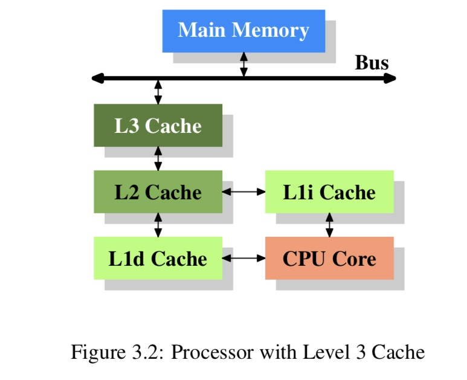
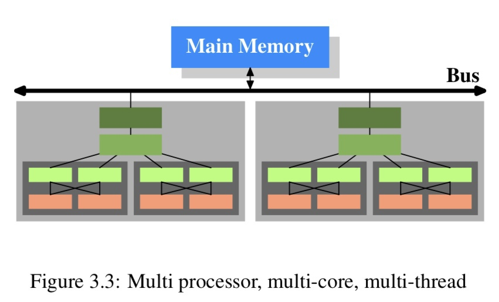
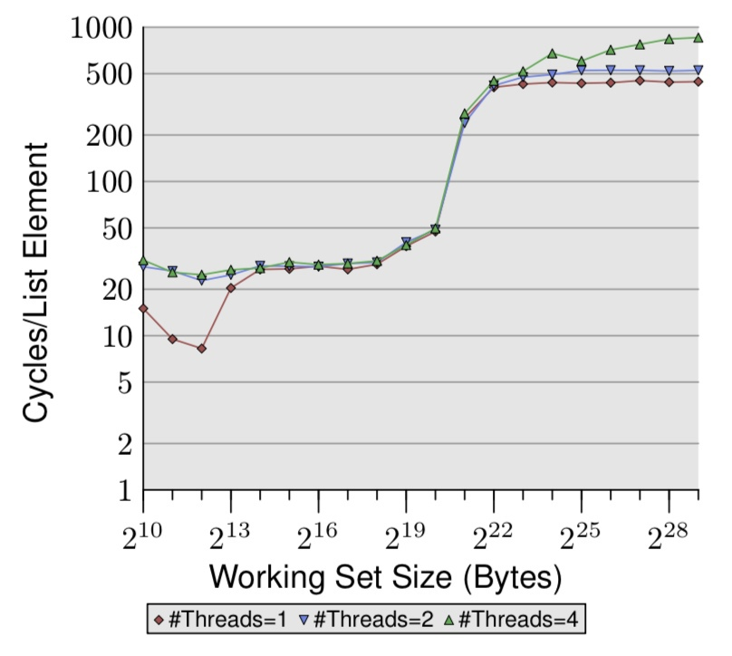
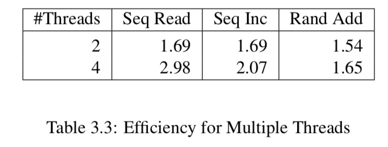
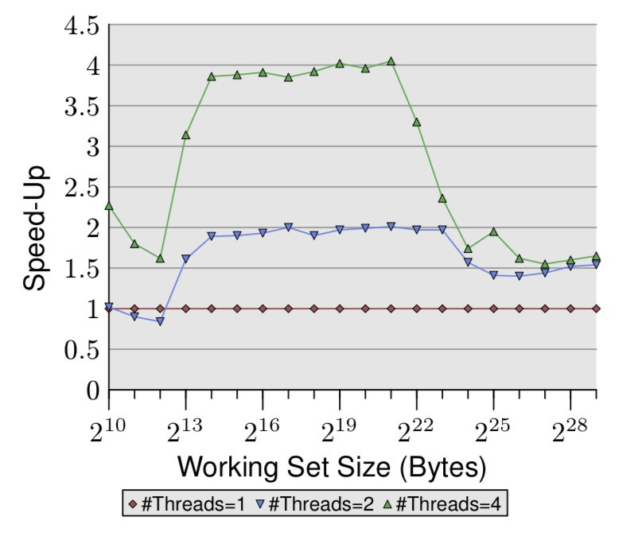

# Семинар по многопоточным вычислениям #

Список разделов:
- Постановка задачи
- pthread_create()
- pthread_join()
- Учебный пример
- Spin lock
- Кэширование 

## Постановка задачи ##
Необходимо вычислить определенный интеграл заранее выбранной функции на заранее выбранном интервале. На вход программы подается количество потоков, на которых она должна выполняться. Необходимо подобрать параметры так, чтобы время выполнения линейно уменьшалось с ростом числа потоков. 

## pthread_create() ##

```cpp
#include <pthread.h>

int pthread_create(pthread_t *restrict thread,
                    const pthread_attr_t *restrict attr,
                    void *(*start_routine)(void *),
                    void *restrict arg);
```

The pthread_create() function starts a new thread in the calling
process.  The new thread starts execution by invoking
start_routine(); arg is passed as the sole argument of
start_routine().

The new thread terminates in one of the following ways:

* It calls pthread_exit(3), specifying an exit status value that
    is available to another thread in the same process that calls
    pthread_join(3).

* It returns from start_routine().  This is equivalent to calling
    pthread_exit(3) with the value supplied in the return
    statement.

* It is canceled (see pthread_cancel(3)).

* Any of the threads in the process calls exit(3), or the main
    thread performs a return from main().  This causes the
    termination of all threads in the process.

## pthread_join() ##

```cpp
#include <pthread.h>

int pthread_join(pthread_t thread, void **retval);
```

The pthread_join() function waits for the thread specified by
thread to terminate.  If that thread has already terminated, then
pthread_join() returns immediately.  The thread specified by
thread must be joinable.

## Учебный пример ##

```cpp
int sum;

void* worker(void* data){

    int i;

    for (i = 0; i < 10000; i++){

        sum += 1; //inc(&sum);
    }

    return 0;
}

int main(){

    for (int i = 0; i < 10000; i++){

        pthread_create(&tid, NULL, worker, NULL);
    }
}
```

В этом примере операция увеличения sum не является атомарной, поэтому конечная сумма может отличаться от запуска к запуску.

## Spin lock ##
Одним из решений этой проблемы является применение инструкций с префиксом lock. Они на порядок дольше аналогичных обычных инструкций, поэтому не являются достаточно эффективными. Во время выполнения lock команды все потоки, пытающиеся получить доступ к заблокированному ресурсу, ожидают окончания блокировки. В это время они продолжают потреблять процессорное время. 

## Кэширование ##
В современных процессорах реализуется многоуровневое кэширование. На картинке изображена общая схема кэширования. В L1i хранится код текущей программы, в то время как в остальных могут храниться любые данные.



В компьютере может быть множество процессоров, со множеством ядер. Общая схема системы с двумя процессорами, в которых по два ядра с двумя потоками, представлена ниже:



The cores can run completely independently
unless they are using the same resources–e.g., the connections to the outside–at the same time. Threads, on the
other hand, share almost all of the processor’s resources.
Intel’s implementation of threads has only separate registers for the threads and even that is limited, some registers are shared. 

Потоки на одном ядре разделяют кэш первого уровня. Ядра разделяют кэши второго и третьего уровней.

Если процессору необходимы данные, первым делом поиск производится в кэше. Каждая кэш линяя характеризуется адресом в основной памяти. В зависимости от реализации адрес может быть как виртуальным, так и физическим. (в статье написано, что длина кэш линии 64 байта)

A cache line which has been written
to and which has not been written back to main memory
is said to be “dirty”. Once it is written the dirty flag is
cleared.

Intel implements inclusive caches19 where each cache line in
L1d is also present in L2. Therefore evicting from L1d is
much faster.

In symmetric multi-processor (SMP) systems the caches
of the CPUs cannot work independently from each other.
All processors are supposed to see the same memory content at all times. The maintenance of this uniform view
of memory is called “cache coherency”. If a processor
were to look simply at its own caches and main memory it would not see the content of dirty cache lines in
other processors. Providing direct access to the caches
of one processor from another processor would be terribly expensive and a huge bottleneck. Instead, processors
detect when another processor wants to read or write to a
certain cache line.

If a write access is detected and the processor has a clean
copy of the cache line in its cache, this cache line is
marked invalid. Future references will require the cache
line to be reloaded. Note that a read access on another
CPU does not necessitate an invalidation, multiple clean
copies can very well be kept around.

Assume a cache line is dirty in
one processor’s cache and a second processor wants to
read or write that cache line. In this case the main memory is out-of-date and the requesting processor must, instead, get the cache line content from the first processor. Through snooping, the first processor notices this
situation and automatically sends the requesting processor the data. This action bypasses main memory, though
in some implementations the memory controller is supposed to notice this direct transfer and store the updated
cache line content in main memory. If the access is for
writing the first processor then invalidates its copy of the
local cache line.

The outcome of all this
can be summarized in a few simple rules:
- A dirty cache line is not present in any other processor’s cache.
- Clean copies of the same cache line can reside in
arbitrarily many caches.

Когда в программе несколько потоков, они должны быть синхронизированы между собой, поэтому программа может замедляться из-за:
- нагрузка на bus(шина) при синхронизации 
- отправка RFO(запрос владения кэшом)
- задержки на шине 



Поскольку оси Y в логарифмическом масштабе, не очень заметна разница между разным количеством потоков, но вот данные в процентах:

We still have about a 18% penalty for running two threads and now an amazing 93% penalty for
running four threads. This means the prefetch traffic together with the write-back traffic is pretty much saturating the bus when four threads are used.

Эффективность для несинхронизированных потоков:




